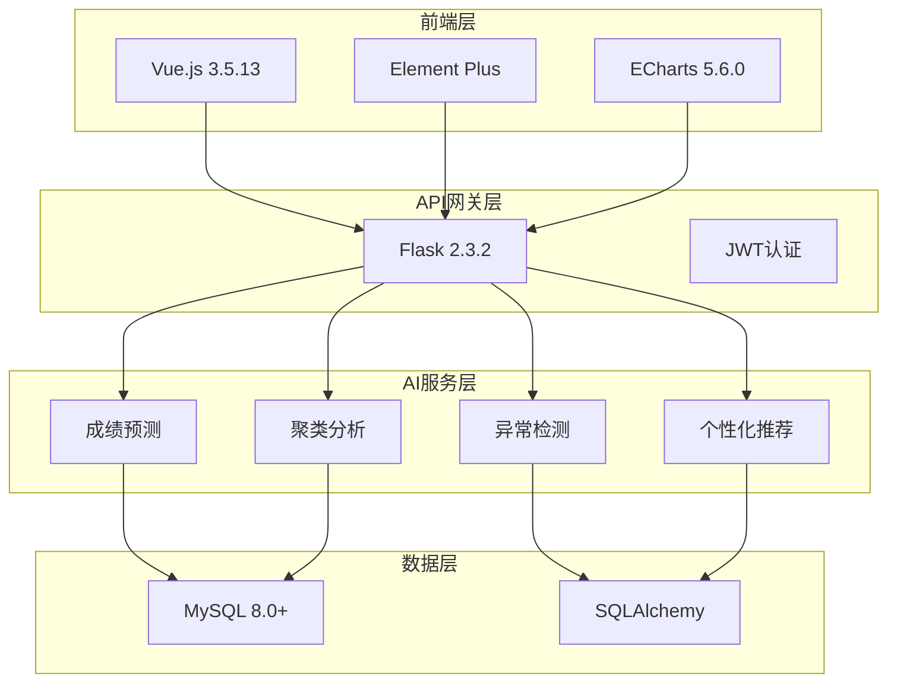

# 📊 课程学习数据可视化分析系统

<div align="center">


*一个基于人工智能的教育数据可视化分析平台*

[🚀 快速开始](#-快速开始) • 
[📖 文档](#-文档体系) • 
[🤖 AI功能](#-机器学习功能) • 
[🛠️ 技术栈](#️-技术架构) • 
[📺 演示](#-功能演示) • 
[🤝 贡献](#-贡献指南)

</div>

---

## 📋 项目概述

**课程学习数据可视化分析系统** 是一个为 **莆田学院新工科产业学院数据225班** 量身定制的智能教育数据分析平台。

通过融合 **机器学习算法**、**大数据分析** 和 **现代化Web技术**，系统能够深度挖掘学习数据价值，为教育决策提供科学依据。

### 🎯 核心价值主张

<table>
<tr>
<td width="33%">

**👨‍🎓 学生价值**
- 📈 个人学习画像可视化
- 🎯 智能学习路径推荐
- ⚡ 实时学习状态反馈
- 🏆 同伴学习对比分析

</td>
<td width="33%">

**👨‍🏫 教师价值**
- 🔍 精准识别问题学生
- 📊 班级学习态势分析
- 🤖 AI辅助教学决策
- 📋 个性化干预建议

</td>
<td width="34%">

**🏫 管理价值**
- 📈 教学质量量化评估
- 🎯 教学资源优化配置
- 📊 数据驱动决策支持
- 🔄 教学效果闭环改进

</td>
</tr>
</table>

### ✨ 核心功能矩阵

| 功能模块 | 技术实现 | 业务价值 | 用户群体 |
|---------|---------|---------|----------|
| 📊 **智能数据看板** | Vue3 + ECharts | 学习状态可视化 | 学生/教师 |
| 🤖 **AI行为分析** | K-means + 孤立森林 | 学习模式识别 | 教师/管理员 |
| 📈 **成绩预测引擎** | 多算法自适应 | 学习效果预测 | 全员 |
| 🚨 **异常检测系统** | Isolation Forest | 风险学生识别 | 教师/管理员 |
| 💡 **个性化推荐** | 协同过滤算法 | 学习建议生成 | 学生 |
| 🔄 **数据导入平台** | 批量处理 + 验证 | 数据管理效率 | 管理员 |

## 🏗️ 技术架构

### 🌟 架构设计理念

<div align="center">



</div>

### 🛠️ 技术栈详解

#### 前端技术栈

| 技术 | 版本 | 用途 | 特色 |
|------|------|------|------|
| **Vue.js** | 3.5.13 | 渐进式框架 | Composition API + 响应式 |
| **Element Plus** | 2.9.7 | UI组件库 | 企业级组件 |
| **ECharts** | 5.6.0 | 数据可视化 | 交互式图表 |
| **Vite** | 6.1.0 | 构建工具 | 热重载 + 快速构建 |

#### 后端技术栈

| 技术 | 版本 | 用途 | 特色 |
|------|------|------|------|
| **Flask** | 2.3.2 | Web框架 | 轻量级 + 高扩展性 |
| **SQLAlchemy** | 3.0.5 | ORM框架 | 数据模型 + 查询优化 |
| **scikit-learn** | 1.3.0 | 机器学习 | 模型训练 + 预测 |
| **MySQL** | 8.0+ | 数据库 | 事务支持 + 高性能 |

## 🚀 快速开始

### 📋 系统要求

| 组件 | 最低版本 | 推荐版本 | 说明 |
|------|----------|----------|------|
| **Node.js** | v18.0+ | v20.0+ | 前端构建环境 |
| **Python** | 3.9+ | 3.11+ | 后端运行环境 |
| **MySQL** | 8.0+ | 8.0.35+ | 数据库服务 |
| **Git** | 2.30+ | Latest | 版本控制 |
| **内存** | 4GB+ | 8GB+ | 系统运行内存 |
| **磁盘** | 2GB+ | 5GB+ | 项目存储空间 |

### ⚡ 一键安装脚本

```bash
# 克隆项目
git clone ssh://git@ssh.github.com:443/Ra1nyLuv/Data_Visualization_Project_Practice.git
cd Data_Visualization_Project_Practice

# 安装所有依赖
npm install
cd frontend && npm install
cd ../backend && pip install -r requirements.txt
```

### ▶️ 一键启停系统

项目提供了一键启停脚本，可以方便地启动和停止整个系统：

```bash
# 启动整个系统（后端+前端）
python system-start.py
```

脚本会自动启动：
- 后端服务：http://localhost:5000
- 前端服务：http://localhost:5173

使用 `Ctrl+C` 可以优雅地停止所有服务。

### 🔧 环境配置

#### 1. 环境变量设置
```bash
# 复制配置模板
cp .env.example .env

# 编辑配置文件
vim .env
```

2. **编辑环境变量** (`.env`):
```bash
# 数据库配置
MYSQL_HOST=localhost
MYSQL_USER=root
MYSQL_PASSWORD=your_strong_password
MYSQL_DB=project_db

# 安全配置
JWT_SECRET_KEY=your-256-bit-secret-key
FLASK_SECRET_KEY=flask-secret-key

# 应用配置
FLASK_ENV=development
CORS_ORIGINS=http://localhost:5173
```

#### 2. 数据库初始化
```sql
CREATE DATABASE project_db CHARACTER SET utf8mb4 COLLATE utf8mb4_unicode_ci;
```

```bash
# 运行数据库迁移
cd backend
flask db upgrade

# 导入示例数据
cd database_import
python users_importer.py
python synthesis_grades_importer.py
```

### 🏃‍♂️ 启动服务

```bash
# 终端1: 后端服务
cd backend
python app.py
# 🔗 http://localhost:5000

# 终端2: 前端服务
cd frontend
npm run dev
# 🔗 http://localhost:5173
```

### 👤 管理员账户设置

由于安全考虑，需要手动创建管理员账户：

1. 在前端注册一个账户 (如用户ID: `admin`)
2. 在数据库中修改角色：
```sql
UPDATE users SET role = 'admin' WHERE id = 'admin';
```

## 📚 文档体系

我们构建了全方位的文档体系，涵盖从新手入门到高级开发的各个层面：

<div align="center">

| 📖 文档类别 | 适用人群 | 完成度 | 快速链接 |
|----------|----------|--------|----------|
| 🚀 **快速开始** | 新手开发者 | ✅ 100% | [development.md](./docs/development.md) |
| 🏗️ **系统架构** | 架构师 | ✅ 95% | [system_architecture.md](./docs/system_architecture.md) |
| 📖 **API参考** | 前后端开发 | ✅ 100% | [api.md](./docs/api.md) |
| 🤖 **AI算法** | 算法工程师 | ✅ 100% | [machine-learning.md](./docs/machine-learning.md) |
| 🚀 **部署指南** | 运维工程师 | ✅ 95% | [deployment.md](./docs/deployment.md) |
| 🔧 **问题解决** | 全体开发者 | ✅ 100% | [troubleshooting.md](./docs/troubleshooting.md) |

</div>

## 🎯 使用指南

### 👨‍🎓 学生用户
1. 使用学号登录系统
2. 查看个人学习数据仪表盘
3. 分析学习趋势和排名情况
4. 获取个性化学习建议

### 👨‍🏫 管理员用户
1. 使用管理员账户登录
2. 访问管理员数据看板
3. 进行机器学习模型训练
4. 查看智能分析结果
5. 识别需要关注的学生
6. 导入和管理学生数据

## 🤖 机器学习功能

### 🧠 AI算法引擎概览

我们的AI系统采用多模型融合策略，通过四大核心算法模块提供全方位的教育数据分析服务。

#### 🔬 核心算法矩阵

<table>
<tr>
<td width="50%">

**📈 成绩预测引擎**
- 🧠 **算法**: 自适应选择 (Ridge/DecisionTree/RandomForest)
- 🎯 **功能**: 预测学生期末成绩，提供置信度评估
- ✨ **特色**: 特征重要性分析 + 个性化建议
- 🎢 **自适应**: 根据数据规模自动选择最优算法

**🚨 异常行为检测**
- 🧠 **算法**: Isolation Forest + 多维度特征
- 🎯 **功能**: 识别5种异常类型，三级风险预警
- ✨ **特色**: 早期干预 + 精准定位问题学生
- 📉 **类型**: 低参与度、学习规律异常、表现不佳等

</td>
<td width="50%">

**📊 学习行为聚类**
- 🧠 **算法**: K-means + 肘部法则优化
- 🎯 **功能**: 识别4种学习模式，指导教学策略
- ✨ **特色**: 自适应聚类数量 + 动态模型更新
- 🏆 **模式**: 高效型、稳定型、需帮助型、观望型

**💡 个性化推荐系统**
- 🧠 **算法**: 混合推荐 (协同过滤 + 内容推荐)
- 🎯 **功能**: 生成学习资源和策略建议
- ✨ **特色**: 实时更新 + 多维度个性化
- 📅 **内容**: 学习资源、学习方法、改进方向

</td>
</tr>
</table>

## 📊 系统特色

### 🎨 数据可视化
- **ECharts集成**: 丰富的图表类型 (柱状图、饼图、热力图)
- **响应式设计**: 适配各种屏幕尺寸
- **实时更新**: 数据变化实时反映在图表中
- **交互体验**: 图表点击、悬停等交互功能

### 🔒 安全特性
- **JWT认证**: 无状态的用户认证机制
- **角色权限**: 学生/管理员分级权限控制
- **密码加密**: Bcrypt安全哈希算法
- **CORS配置**: 严格的跨域资源共享控制

### ⚡ 性能优化
- **懒加载**: Vue组件和路由懒加载
- **缓存策略**: 智能的数据缓存机制
- **异步处理**: 非阻塞的API调用
- **代码分割**: Vite自动代码分割优化

### 🔧 开发体验
- **热重载**: 开发时实时更新
- **ESLint/Prettier**: 代码质量和格式化
- **类型检查**: JavaScript类型安全
- **调试工具**: 完善的调试和诊断工具


## 🚨 常见问题

### 常见问题及解决
| 问题         | 症状               | 解决方案                |
| ------------ | ------------------ | ----------------------- |
| 前端启动失败 | Node.js版本错误    | 升级到Node.js v18+      |
| 后端连接失败 | 数据库连接错误     | 检查.env配置和MySQL服务 |
| 跨域问题     | API调用被阻止      | 确认前后端端口配置      |
| ML训练失败   | 数据量不足         | 确保数据库有≥3个用户    |
| 权限错误     | 管理员功能无法访问 | 检查用户role字段        |


## 📺 功能演示

### 📈 学生数据看板
- **个人学习成绩分析**: 实时显示学习进度和排名情况
- **学习行为热力图**: 可视化学习时间分布和习惯
- **智能学习建议**: AI生成的个性化改进建议

### 🏛️ 管理员控制台
- **班级整体分析**: 成绩分布、活跃度统计、学习效果评估
- **AI智能分析**: 学习行为聚类、异常学生检测
- **数据管理平台**: 一键导入Excel数据，自动数据清洗


### 🐛 报告问题
- 使用 [GitHub Issues](https://github.com/Ra1nyLuv/Data_Visualization_Project_Practice/issues) 报告问题
- 提供详细的复现步骤和错误信息
- 添加相关的系统信息和日志

### 🛠️ 功能建议
- 描述新功能的业务价值和使用场景
- 提供技术实现思路和设计草图
- 考虑对现有系统的影响和兼容性

### 📝 代码贡献
1. **Fork** 本仓库
2. **创建特性分支**: `git checkout -b feature/amazing-feature`
3. **提交更改**: `git commit -m 'Add amazing feature'`
4. **推送分支**: `git push origin feature/amazing-feature`
5. **创建 Pull Request**

## 📅 项目信息

### 🏆 项目状态
- **开发状态**: ✅ 生产就绪 (Production Ready)
- **版本**: v2.0 - 企业级稳定版本
- **最后更新**: 2025-09-12
- **授权协议**: MIT License

### 👥 开发团队
- **项目负责人**: 陈俊霖 (莆田学院数据225班)
- **指导教师**: 莆田学院计算机与大数据学院
- **项目类型**: 本科毕业设计项目

### 🔗 相关链接
- **GitHub 仓库**: [Ra1nyLuv/Data_Visualization_Project_Practice](https://github.com/Ra1nyLuv/Data_Visualization_Project_Practice)
- **在线演示**: (待部署)
- **技术博客**: (待更新)
- **API 文档**: [docs/api.md](./docs/api.md)

### ✨ 致谢
感谢所有为这个项目做出贡献的开发者和研究者，特别感谢莆田学院计算机与大数据学院的支持和指导。

---

<div align="center">

**如果这个项目对您有帮助，请给我们一个 ⭐ Star！**


Copyright © 2025 莆田学院计算机与大数据学院 数据225班

</div>
