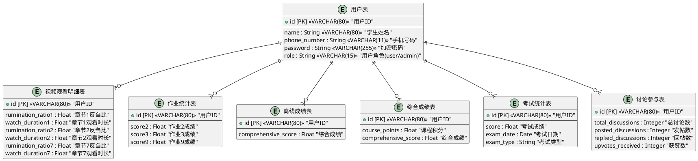

# 数据库ER图

```plantuml
@startuml
entity 用户表 {
  + id [PK] <<VARCHAR(80)>> "用户ID"
  ---
  name : String <<VARCHAR(80)>> "学生姓名"
  phone_number : String <<VARCHAR(11)>> "手机号码"
  password : String <<VARCHAR(255)>> "加密密码"
  role : String <<VARCHAR(15)>> "用户角色(user/admin)"
}

entity 视频观看明细表 {
  + id [PK] <<VARCHAR(80)>> "用户ID"
  ---
  rumination_ratio1 : Float "章节1反刍比"
  watch_duration1 : Float "章节1观看时长"
  rumination_ratio2 : Float "章节2反刍比"
  watch_duration2 : Float "章节2观看时长"
  rumination_ratio7 : Float "章节7反刍比"
  watch_duration7 : Float "章节7观看时长"
}

entity 作业统计表 {
  + id [PK] <<VARCHAR(80)>> "用户ID"
  ---
  score2 : Float "作业2成绩"
  score3 : Float "作业3成绩"
  score9 : Float "作业9成绩"
}

entity 离线成绩表 {
  + id [PK] <<VARCHAR(80)>> "用户ID"
  ---
  comprehensive_score : Float "综合成绩"
}

entity 综合成绩表 {
  + id [PK] <<VARCHAR(80)>> "用户ID"
  ---
  course_points : Float "课程积分"
  comprehensive_score : Float "综合成绩"
}

entity 考试统计表 {
  + id [PK] <<VARCHAR(80)>> "用户ID"
  ---
  score : Float "考试成绩"
  exam_date : Date "考试日期"
  exam_type : String "考试类型"
}

entity 讨论参与表 {
  + id [PK] <<VARCHAR(80)>> "用户ID"
  ---
  total_discussions : Integer "总讨论数"
  posted_discussions : Integer "发帖数"
  replied_discussions : Integer "回帖数"
  upvotes_received : Integer "获赞数"
}

用户表 ||--o{ 视频观看明细表
用户表 ||--o{ 作业统计表
用户表 ||--o{ 离线成绩表
用户表 ||--o{ 综合成绩表
用户表 ||--o{ 考试统计表
用户表 ||--o{ 讨论参与表
@enduml
```

## 使用说明
1. 安装VSCode PlantUML插件或在线工具渲染
2. 图表基于实际数据库设计：
   - 主外键关联关系对应数据库约束
   - 字段类型与数据库表结构一致
   - 实体关系参考Migrations历史版本