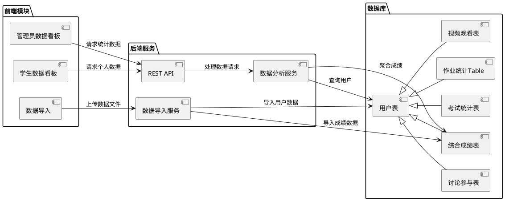

# 系统模块图

```plantuml
@startuml
left to right direction

package "前端模块" {
  [管理员数据看板] as AdminDashboard
  [学生数据看板] as StudentDashboard
  [数据导入] as DataImport
}

package "后端服务" {
  [REST API] as API
  [数据分析服务] as Analysis
  [数据导入服务] as ImportService
}

package "数据库" {
  [用户表] as Users
  [综合成绩表] as Synthesis
  [考试统计表] as Exam
  [作业统计Table] as Homework
  [视频观看表] as Video
  [讨论参与表] as Discussion
}

AdminDashboard --> API : 请求统计数据
StudentDashboard --> API : 请求个人数据
DataImport --> ImportService : 上传数据文件
API --> Analysis : 处理数据请求
ImportService --> Users : 导入用户数据
ImportService --> Synthesis : 导入成绩数据
Analysis --> Users : 查询用户
Analysis --> Synthesis : 聚合成绩
Users <|-- Synthesis
Users <|-- Exam
Users <|-- Homework
Users <|-- Video
Users <|-- Discussion
@enduml
```

## 使用说明
1. 安装VSCode PlantUML插件或在线工具渲染
2. 图表基于实际代码中的模块关联关系：
   - 前端模块与后端API的交互逻辑
   - 数据导入服务与数据库表的关联
   - 数据分析服务的聚合逻辑参考`backend/app.py`